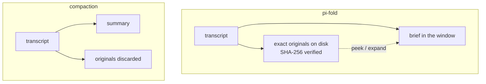
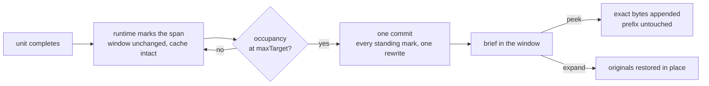

# pi-fold

[](https://doi.org/10.5281/zenodo.21856873)

Agent-governed lossless context folding for Pi. A session folds its own transcript instead of losing it: the stale end collapses into short briefs while the exact originals stay on disk, addressed and verified by SHA-256, one tool call away.


*Marks outline spans as they complete and move nothing; the next fold event commits every standing mark in one rewrite. Expanding a brief brings the exact messages back byte for byte. Illustrative animation, not a screen capture, and it draws the 2.x surface where the agent laid the marks; since 3.0 the runtime lays each mark the moment a unit completes and the agent's job is the brief.*

## Install

```sh
pi install npm:pi-fold
```

Node 22 or later, Pi 0.83 or later. MIT licensed.

Pairs with a long-term memory store, and the results below are the case for doing that. [pi-canon](https://github.com/shaneconner/pi-canon) is one, built alongside this and kept separate on purpose; any store offering durable placement and a followable address should compose the same way.

## What it does

Compaction does not continue a session, it starts a new one: it summarizes the transcript, discards the originals, and begins again from the summary. Folding keeps the turn.



A fold takes a contiguous span of session entries and replaces it, in the window only, with a short brief. The entries go to a fold store byte for byte, addressed by their SHA-256 hash. The brief carries a handle, the handle resolves to the original, and expansion restores the exact bytes after verifying the hash. A fold is a claim the runtime can check, not one the reader has to trust.

The package registers one tool, `pi_fold_context`, with nine actions over the transcript: `status`, `peek`, `brief`, `expand`, `refold`, `pin`, `unpin`, `reboundary` and `unmark`. It also registers `/fold`, `/fold-editor`, `/fold-status` and `/fold-settings` for the human. A session that never calls the tool still folds; it degrades into lossless hierarchical compaction.

## Results

One 64-stage assignment over the curl C repository, delivered as a single agentic turn per run. Model gpt-5.6-sol at xhigh effort, 272,000-token descriptor, 251,520-token serving budget, identical in every run. After all 64 stages landed, one withheld final message asked sixteen questions about material from across the whole session.

| Condition | Correct of 16 | Wrong | Cost |
| --- | :--- | ---: | ---: |
| Compaction | 4 | 3 | $151.24 |
| Compaction + memory store | 14 | 0 | $201.70 |
| pi-fold, deterministic briefs | 14 · 14 · 9 · 8 | 0 · 0 · 7 · 7 | $83.98 to $109.52 |
| pi-fold + memory store | 14 | 0 | $100.85 |
| pi-fold, agent-written briefs | 3 | 9 | $111.96 |

Four things the table says, in order of how much they should change a decision:

**Composed with a store, the two mechanisms score the same and the fold costs half.** 14 correct and nothing wrong on both, $100.85 against $201.70. The gap is request count, not price per request: the two arms paid the same per provider request, and compaction needed 1,700 of them against the fold's 916 for the same 64 stages, plus $14.73 of summarizer calls that never appear in its provider ledger.

**Compaction alone did not confabulate, it abstained.** Four correct, three wrong, nine abstentions. That is the honest move for a mechanism whose summary is all it has, and it is why the recommendation below is a store rather than a scolding.

**The fold's deterministic draws are bimodal.** Two draws answered 14 with nothing wrong; two lost old material and answered 9 and 8. Cost does not predict which: the cheapest run of the campaign tied the best score, and the most expensive fold draw hit the seven-wrong mode. The store removed that variance in both attempts it was given, which is two for two and suggestive, not a rate.

**Agent-written briefs scored worst of everything, by a wide margin.** Inviting the model to improve a brief drew 3 correct against 9 wrong. That is why deterministic briefs are the shipped default and the invitation is off.

Wall clock ran with the money here, 4.1 to 5.3 hours for the fold runs against 6.9 for compaction and 9.0 for compaction with a store, though an earlier campaign ordered it the other way, so that is a result and not a law. The long-context price tier is not this campaign's story either: neither composed run crossed it.

### The setup to run

Deterministic briefs alongside a long-term memory store, which is the shipped default plus one store.

Rotation and retention are different jobs. Rotation gets stale material out of the window. Retention keeps what the session learned. A handoff summary does both in one pass, which is why it works and also where it runs out: it is durable context living in exactly one record, written once under time pressure, bounded by the window it has to fit inside. Folding is the rotation half and only that half. A store is the other: many records rather than one, each at its own address, written as the work happens, outliving the session.

### Scheduling, measured against itself

Folding is cheap to decide and expensive to apply, and the expense is set by how often the projection changes rather than by how much each change reclaims. Two runs on the same plan and seed with scheduling as the only variable: applying each fold when it was made spent 19,623,502 fresh input tokens at a pooled cache share of 0.119, and recording marks to land together spent 3,603,440 at 0.756. A 5.4x reduction in what the provider had to read for the first time. It was slower in wall clock, 33.5 minutes against 26.7, so that trade bought tokens and not time.

Papers, figure sources, redacted per-request ledgers and campaign logs are on Zenodo: [the design and trace evaluation](https://doi.org/10.5281/zenodo.21856873), [working memory under context shedding](https://doi.org/10.5281/zenodo.21980746), [ephemeral retrieval](https://doi.org/10.5281/zenodo.22142454), and [rotation and retention](https://doi.org/10.5281/zenodo.22142456), which is the campaign above. Narrative versions are on Medium, from [compaction doesn't have to mean starting over](https://medium.com/@shane.conner/compaction-doesnt-have-to-mean-starting-over-89c0b319d1a6) to [a compaction summary is one record doing a store's job](https://medium.com/@shane.conner/a-compaction-summary-is-one-record-doing-a-stores-job-3f46212ef059). Interactive versions of every mechanism on this page are at [shaneconner.com/projects/pi-fold](https://shaneconner.com/projects/pi-fold/). Full chronology: [the experiment log](https://github.com/shaneconner/pi-fold/blob/main/docs/fold_vs_compaction/experiment-log.md).

## Limits

- The benchmarks were built to reproduce specific things compaction was believed to handle badly. That makes them useful and it makes them narrow. They are not a neutral sample of real work.
- Runs were accumulated adaptively: one to four per condition, a sequential case series rather than a fixed-N trial.
- Nothing here estimates production behavior, because that is not something this setup can test.
- Native compaction is strong and is the right default for most sessions. It costs nothing to adopt, needs no tool surface, and models are trained under it. This is an alternative for workflows where the numbers above matter, not a replacement.
- Lossless recall is worth less alone than it sounds: an agent in a real deployment can usually reach its own transcript by other means. The pairing with a store is where the measured value sat.

## How it works

### One invariant, and it is the reason several reasonable features are absent

**A provider prefix cache is positional.** It replays the longest byte-identical prefix of the prompt, so one changed byte at offset K discards everything cached after K. The cost of a mutation has nothing to do with its size.

**So the runtime may move a byte in the window only at a moment it is already rewriting the window**, which is a commit or a fold. Everything else is a pure append, and an appended byte is never later altered, shortened, removed or repositioned. Never mutate the window, and never show something and then take it back. The second half is the one that costs features: anything that displays state and then updates it in place is out, because updating in place is a mid-prefix write with better manners.

### Marks are free, commits are not



A mark moves nothing. The moment a tool batch or chapter closes, the frontier cuts it into a pending mark, up to eight cuts per pass, stalest first. The mark lives in durable state outside the window, so the projection stays byte-identical and the cached prefix survives. Marks accumulate for free until one commit applies all of them in a single rewrite.

What the agent owns is the words. `brief` writes its own sentence onto a pending fold for free, because that brief reaches the window only when the commit writes the placeholder for the first time. A supplied brief is kept verbatim; an unbriefed fold commits with the deterministic brief the runtime writes from the span itself, and the provenance records which happened. Curation stays correctable until the commit: `reboundary` re-cuts a span, `unmark` withdraws a pending mark, and a pending brief can be rewritten any number of times at no cost. A standing fold's brief is never rewritten, because that rewrites the projection at its placeholder.

### The band

A commit fires on one condition: occupancy reaching `maxTarget` of the serving budget. It applies marks stalest first and stops at `minTarget`, so the newest events stay raw and a mark past the bound waits for the next epoch. Below `maxTarget` the window is quiet, because a commit is an epoch transition that risks the whole prefix cache and the right cadence is the fewest commits that keep the window inside its budget.

```
272,000  the transport's descriptor
─────────────────────────────────────────────────────
~250k    peak: inflow continues while the epoch computes
217,600  maxTarget 0.80   ← the commit fires here
   ⋮                        marks accumulate, free, quiet
 54,400  minTarget 0.20   ← the commit stops here
─────────────────────────────────────────────────────
```

The floor is where cadence is bought. Every commit re-reads roughly `minTarget` of the budget uncached, so a shallower cut buys less runway for nearly the same bill: the rewrite tax is `minTarget / (maxTarget - minTarget)`, 0.33 at 0.80/0.20 against 1.0 at 0.80/0.40.

### Reading is cheap, and stays out of the way

`peek` returns a fold's exact SHA-256-verified source as a tool result at any depth, with the ancestors still collapsed. It appends and never edits the prefix, so checking what a fold holds costs nothing a commit has to pay for. It takes `offset` and `bytes` for a bounded slice and reads any child fold by id, so a large fold has a narrow read.

A peek is ephemeral by default: the bytes ride the window until the model's next message, then their place holds a one-line placeholder and the reply that used them is the surviving trace. Peeking again is lossless and costs one append. The default follows what agents chose: on the run measured for it, six of seven peeks asked for ephemeral at first exposure. `expand` is the commitment, restoring the source in place until the fold is refolded. Looking is not the same as taking.

### Everything else

Tool results get a second, lighter treatment at the same commit. Results in the oldest `toolFoldThreshold` share of the projected window, half of it by default, are clipped in view: the identifying head stays, the rest becomes a marker naming the entry id that peeks it back, and the stored bytes are untouched, so a later fold of that span still encodes the full result.

Briefs are bounded at 2,000 characters each, so the visible index normally costs a low single-digit share of the window. Folds nest rather than partially overlap, and collapsed folds double as a browsable index: `status` with `detail: "tree"` lists every fold in transcript order with its depth and parent. `pin` holds entries raw through every fold and frees nothing, so pinned mass makes the rest of the window fold sooner; a pinned-share cap stops that from becoming a window nothing can reclaim.

Pi's automatic compaction stays enabled underneath and is intercepted by kind. A threshold pass is cancelled, because the fold commit fires first. An overflow pass becomes an automated recovery: the session branches back to the last message before the error, and the retried pass folds and commits before transmitting. Manual `/compact` passes through untouched as the escape hatch.

Evidence ingestion writes read-only artifacts under the session directory's `pi-fold-evidence/` at mode `0444`, under a 512 MB session cap. It is always on: the artifacts are what an oversized result folds against, so a deployment that stopped writing them would keep its folds and lose what makes them lossless.

## Configuration

`registerPiFold(pi)` takes six options and refuses every other name.

| Option | Default | Effect |
| --- | --- | --- |
| `thresholds` | `{ maxTarget: 0.80, minTarget: 0.20, consolidateAfter: 10, minFoldChars: 8000 }` | The band, set whole or not at all. The first two are proportions of the serving budget. `consolidateAfter` is how many visible roots a parent is owed. `minFoldChars` is the size a fold has to reach to be worth making, and the floor a gap between folds has to clear to stay raw. Validated atomically; an impossible policy is refused by name rather than clamped. |
| `providerInputBudget` | the transport's descriptor | The tokens this deployment may actually put in a request, already net of any output reservation. Every ratio, fence and budget on this page is a share of this one number. |
| `blacklistAutoFoldTools` | `new Set()` | The exception list. Every completed tool batch is foldable without an agent mark; name a tool here and its results stay raw. |
| `toolFoldThreshold` | `0.50` | The tool-call diet: a share in `[0, 1)` naming the oldest fraction of the window whose tool results are clipped in view. `0` turns it off. |
| `postFoldNotice` | `false` | The invitation switch. False is the shape that won the campaign above: no carrier invites a brief and every fold ships the runtime's own words. `true` appends a standing invitation to improve a pending brief. |
| `workingMemory` | off | An in-window keyed dictionary the agent maintains beside the fold index, with `remember` and `recall` added to the tool. Offered to one run, which never called it. |

Four commands ship for the human: `/fold-status`, `/fold` (commit every staged mark now), `/fold-editor` (the interactive map of the window) and `/fold-settings`.

Upgrading from 2.x: the `fold` action is gone from the tool surface, since the runtime stages every completed unit itself; `guidance` is refused by name and `postFoldNotice` replaces it; `thresholds.freshTail` is gone, and a settings file carrying it is migrated with every tuned value kept. Existing sessions stay readable, folds and briefs included.

## Prior work

pi-fold combines two recent lines in one mechanism. Lossless hierarchical compaction, exemplified by LCM ([arXiv:2605.04050](https://arxiv.org/abs/2605.04050)) with a walkthrough at [losslesscontext.ai](https://www.losslesscontext.ai/), builds a summary DAG over older messages with lossless pointers to every original, but the system decides when to compact. Agentic context management, exemplified by [Letta](https://github.com/letta-ai/letta) and by [arXiv:2510.11967](https://arxiv.org/abs/2510.11967), gives the agent tools over its own memory, but what it edits is usually a scratchpad beside the transcript rather than the transcript itself. See also [arXiv:2607.00692](https://arxiv.org/abs/2607.00692).

## Status

Stable. The gate suite is the contract: `tests/verify.mjs` covers the runtime and `scripts/verify_pi_context_experiment.mjs` covers the experiment harness. New behavior lands with its gate.

```sh
npm ci
npm run lint
npm test
node scripts/verify_pi_context_experiment.mjs
```
